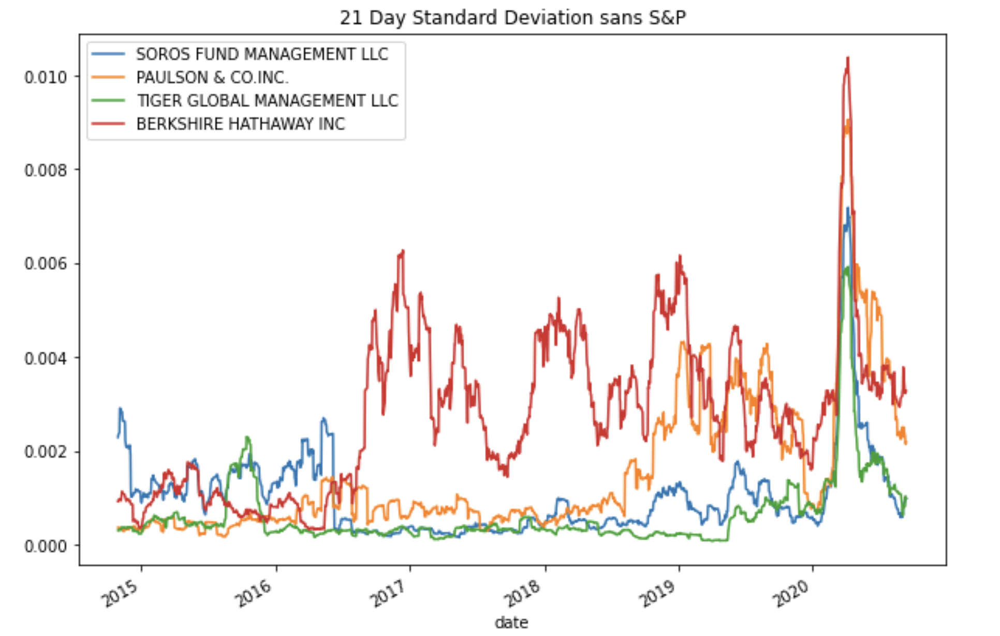

# Portfolio_analysis

The purpose of this project was to analyze popular funds and recommend one for a hypotherical fintech company to offer for their clients.

We analyze performance, volatility, and risk in order to diversify our portfolio of offerings.

---

## Technologies

This code was written on Windows 11 running python 3.7.13. It also uses Pandas (Version 1.3.5), Numpy (Version 1.21.5), and Jupyterlab (Version 3.3.2)

---

## Installation Guide

Both Pandas, Numpy, and Jupyterlab can all be installed using the pip install function.

---

## Usage

This notebook was a single use project to analyze these 4 specific funds. It is not interoperable with another csv file unless you have the exact same column headers. If you are interested in analyzing these 4 specific funds today, provide the notebook with a properly formatted csv of updated values.

---

## Contributors

Garrett Hernandez -gtkhhz@gmail.com

---

## License

This is free and unencumbered software released into the public domain.

Anyone is free to copy, modify, publish, use, compile, sell, or
distribute this software, either in source code form or as a compiled
binary, for any purpose, commercial or non-commercial, and by any
means.

In jurisdictions that recognize copyright laws, the author or authors
of this software dedicate any and all copyright interest in the
software to the public domain. We make this dedication for the benefit
of the public at large and to the detriment of our heirs and
successors. We intend this dedication to be an overt act of
relinquishment in perpetuity of all present and future rights to this
software under copyright law.

THE SOFTWARE IS PROVIDED "AS IS", WITHOUT WARRANTY OF ANY KIND,
EXPRESS OR IMPLIED, INCLUDING BUT NOT LIMITED TO THE WARRANTIES OF
MERCHANTABILITY, FITNESS FOR A PARTICULAR PURPOSE AND NONINFRINGEMENT.
IN NO EVENT SHALL THE AUTHORS BE LIABLE FOR ANY CLAIM, DAMAGES OR
OTHER LIABILITY, WHETHER IN AN ACTION OF CONTRACT, TORT OR OTHERWISE,
ARISING FROM, OUT OF OR IN CONNECTION WITH THE SOFTWARE OR THE USE OR
OTHER DEALINGS IN THE SOFTWARE.

For more information, please refer to <https://unlicense.org>
